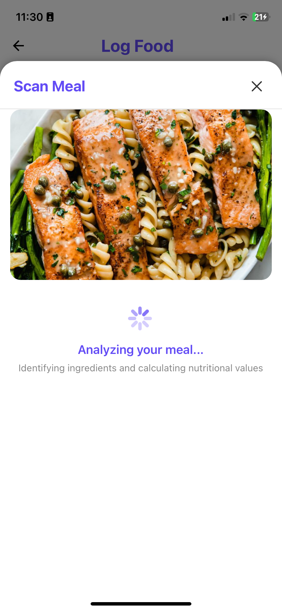
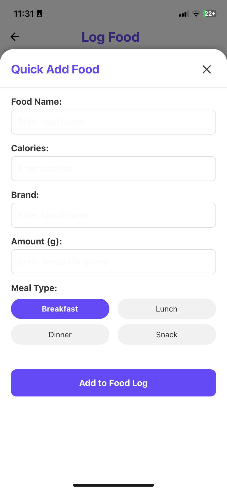

# EatWell: Smart Nutrition Tracking & Meal Planning App 🥗

EatWell is a comprehensive mobile application designed to simplify nutrition tracking and meal planning with advanced AI-powered features. The app helps users make healthier food choices, track their nutritional intake, and create personalized meal plans tailored to their dietary preferences.

## 📱 App Screenshots

<div align="center">
  
  
  
</div>

<div align="center">
  
</div>

### 🍽️ Multiple Ways to Log Your Food

<div align="center">
  
  
  
</div>

<div align="center">
  
  
  
</div>

## 🌟 Features

- **AI-Powered Meal Planning**: Personalized meal suggestions based on dietary preferences and nutritional goals
- **Advanced Food Logging**: Multiple ways to log food including:
  - Image recognition for instant meal analysis
  - Voice commands for hands-free logging
  - Barcode scanning for packaged foods
  - Intelligent search with extensive food database
- **Comprehensive Nutrition Tracking**: Track macronutrients, calories, and other vital nutritional information
- **Interactive Dashboard**: Visualize your nutritional intake with intuitive charts and progress tracking
- **Daily Food Diary**: Log and review your meals throughout the day
- **Clean, Modern UI**: User-friendly interface that makes nutrition tracking a seamless experience

## 🛠️ Technologies Used

- **React Native / Expo**: Cross-platform mobile framework
- **TypeScript**: For type-safe code
- **OpenAI API**: Powering the intelligent meal analysis and planning features
- **Expo Camera**: For food image recognition and barcode scanning
- **React Navigation**: For seamless app navigation
- **Expo Speech**: For voice command functionality
- **Custom UI Components**: For a unique and engaging user experience

## 🚀 Getting Started

### Prerequisites

- Node.js (v14 or higher)
- npm or yarn
- Expo CLI
- OpenAI API key (for AI features)

### Installation

1. Clone the repository
   ```bash
   git clone https://github.com/yourusername/eatwell.git
   cd eatwell
   ```

2. Install dependencies
   ```bash
   npm install
   ```

3. Create a `.env` file in the root directory with your OpenAI API key
   ```
   EXPO_PUBLIC_OPENAI_API_KEY=your_openai_api_key_here
   ```

4. Start the development server
   ```bash
   npx expo start
   ```

5. Run the app on your preferred platform
   - Scan the QR code with the Expo Go app (Android)
   - Press 'i' for iOS simulator (requires macOS with Xcode)
   - Press 'a' for Android emulator (requires Android Studio)

## 📱 App Structure

- **Dashboard**: Overview of daily nutrition and progress tracking ([screenshot](#-app-screenshots))
- **Food Diary**: Log and track your daily meals ([screenshot](#-app-screenshots))
- **Meal Planning**: AI-generated meal plans based on your preferences ([screenshot](#️-multiple-ways-to-log-your-food))
- **Food Logging Tools**: Multiple methods to log your food intake ([screenshot](#️-multiple-ways-to-log-your-food))
- **Profile**: User preferences and settings ([screenshot](#-app-screenshots))

## 🔮 Future Enhancements

- Social sharing features for meal plans
- Integration with fitness tracking apps
- Community recipe sharing
- Weekly and monthly nutritional reports
- Smart grocery lists based on meal plans

## 📄 License

This project is licensed under the MIT License - see the LICENSE file for details.

## 👨‍💻 About the Developer

EatWell was independently developed as a personal project to demonstrate proficiency in mobile application development using React Native and AI integration. The application showcases skills in building complex, user-friendly interfaces and implementing advanced features like image recognition and voice commands.

---

**Note**: This application is a demonstration project and not intended for medical advice. Always consult with healthcare professionals for dietary recommendations.
